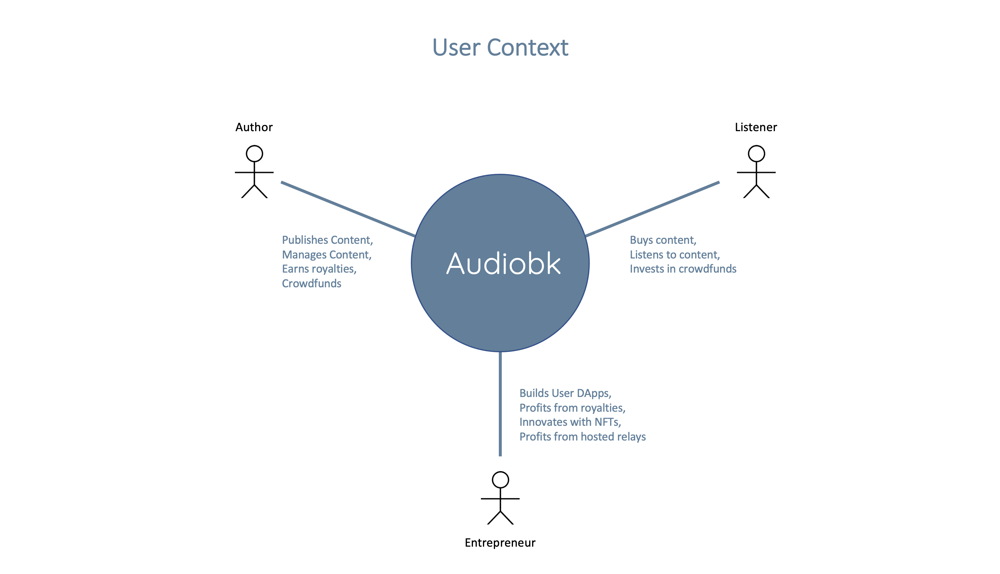
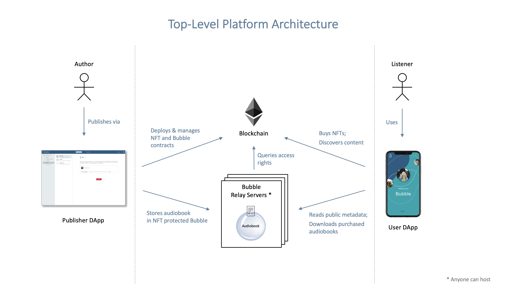
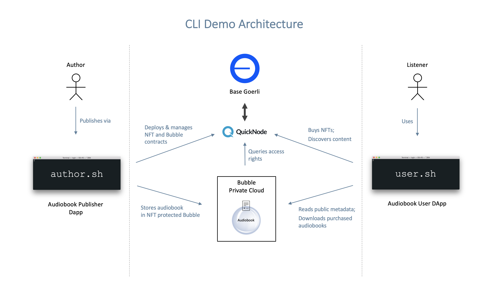

# Audiobook

Web3 version of Audible.

## Description

**This is an alpha test version.  It is meant for demo purposes only and runs on the [Base Goerli](https://base.org) (Ethereum layer 2) testnet.**

Audiobook is a decentralised service for publishing and consuming audiobooks (or indeed any kind of media content).

Audiobooks are sold as NFTs and relayed via servers running the [Bubble Protocol](https://bubbleprotocol.com/).

Authors retain full ownership and control of their content without being tied to a specific company. They get to keep a much higher percentage of the sale price and can crowdfund their book launches (not yet implemented).

Listeners own their audiobooks as NFTs and can use any app they like to listen to them. They can sell their books on an NFT marketplace (if the author permits it) and can invest in authors' crowdfunds to share in their success.

Developers can build end-user dapps and profit from the audiobooks bought through them.

Relay server owners can profit by hosting content with payments handled automatically by the bubble protocol.

## User Context



## Top-Level Architecture



## GUI Version

Coming soon.

## CLI Version

Requires Linux or MacOS.

### Installation

1. Clone this repo
    ```
    git clone git@github.com:Bubble-Protocol/audiobook.git
    ```

2. Install Bubble Tools
    ```
    npm install -g @bubble-protocol/bubble-tools
    ```

3. Initialise your Bubble wallet
    ```
    bubble wallet create user
    bubble wallet create author
    ```

4. Configure Bubble Tools to use the Bubble Private Cloud server
    ```
    bubble servers add bubble-base https://vault.bubbleprotocol.com/v2/base-goerli
    ```

5. Configure Bubble Tools to use the [Base Goerli blockchain](https://base.org)

    The simplest way to do this is to piggyback on Bubble Protocol's blockchain providers.

    ```
    curl https://vault.bubbleprotocol.com:8125/providers > ~/.bubble-tools/providers
    ```

### Usage

In the [`cli`](cli) directory there are two shell scripts, one for authors and another for users:
- Use the `user.sh` script for discovering available books, listening to purchases, buying and selling.
- Use the `author.sh` script for publishing books, managing publications and withdrawing buyers' funds.

This CLI demo uses a single Bubble relay server - the Bubble Private Cloud - and the [Base Goerli](https://base.org) testnet, accessed via the third party [Quicknode](https://www.quicknode.com) blockchain API service.

The blockchain hosts the Audiobook Registry and each book's NFT and Bubble smart contracts (see [Smart Contracts](#smart-contracts) below).  The Bubble Private Cloud hosts the audiobook itself off-chain, in a bubble protected by the NFT.  Only NFT owner's have permission to listen to the book while all users have access to its public metadata.



### Users

You will need funds in your `user` wallet to buy or sell a book.  You can use a [faucet](https://docs.base.org/tools/network-faucets) to get them.  You can find the address of your wallet with the following command:
```
bubble wallet info user
``` 
If you want your private key, for example to add to metamask, it can be found in the `~/.bubble-tools/wallet` directory.

#### Audiobook Discovery
The `discover` command queries the blockchain for published content and reads each book's bubble to retrieve it's public metadata.  It outputs each book's id, author id, author name and title.
```
./user.sh discover

id: 0xC3c4af8360a546f424341a53b05620b25b09Af2c, author-id: 0xc16a409a39EDe3F38E212900f8d3afe6aa6A8929, author: "Homer Simpson", title: "Homer, I Hardly Knew Me"
id: 0x70801CD6e0A3a0AA73d79f3Eb580910A0554C3AD, author-id: 0xc16a409a39EDe3F38E212900f8d3afe6aa6A8929, author: "Yoda", title: "A Walk On The Light Side"
```
To limit the search to a specific author add the author's public id.  E.g.
```
./user.sh discover 0xc16a409a39ede3f38e212900f8d3afe6aa6a8929
```

#### Your Library
The `library` command queries the blockchain for books you've purchased based on your NFT ownership.
```
./user.sh library

book: 0xC3c4af8360a546f424341a53b05620b25b09Af2c, token: 1
```

#### Buying Books
The `buy` command lets you buy a book via its book id.
```
./user.sh buy 0xC3c4af8360a546f424341a53b05620b25b09Af2c

Price is 10000 WEI, do you want to continue? y/n y    
Purchase Successful.  Your purchase and token ID will appear in your library after the transaction has been mined.
```

#### Listening To Books
The `listen` command lets you download a book's audio file provided you own the book's NFT.  If you don't own the book you will see a permission error.
```
./user.sh listen 0xC3c4af8360a546f424341a53b05620b25b09Af2c

Successfully downloaded audiobook to 0xC3c4af8360a546f424341a53b05620b25b09Af2c.mp3
```

#### Selling Books
The `transfer` command transfers a book's NFT to another user.  
```
./user.sh transfer 0xC3c4af8360a546f424341a53b05620b25b09Af2c 1 user2

Successfully transfered token id 1 of book 0xC3c4af8360a546f424341a53b05620b25b09Af2c to account user2
```
Replace `user2` with a label from your wallet or with an account address.


### Authors

You will need funds in your `author` wallet to publish a book, to change its price or to withdraw buyer funds.  You can use a [faucet](https://docs.base.org/tools/network-faucets) to get them.  You can find the address of your wallet with the following command:
```
bubble wallet info author
```  
If you want your private key, for example to add to metamask, it can be found in the `~/.bubble-tools/wallet` directory.

#### Publishing Books

The `publish` command publishes a book to the platform.  It performs the following process:
1. Deploys an NFT smart contract specifically for the book, setting the price given in the book's `metadata.json` file.
2. Creates a bubble to hold the book's protected audio file and public metadata.
    1. Deploys the bubble smart contract
    2. Creates the bubble on the Bubble Private Cloud server
    3. Uploads the book's files to the bubble
3. Registers the book with the on-chain Audiobook Registry

See the example books in the [`cli/example-books`](cli/example-books) directory.  A book's details are specified in its [`metadata.json`](cli/example-books/homer/metadata.json) file.  Audio samples have been sourced from [here](https://www.harlancoben.com/audio-samples/).

Example:
```
cd examples
cp -r homer my_book
cd my_book
edit metadata.json  # configure the book's details and price
# copy audio file and image files as necessary
./author.sh publish 
```

#### Your Bibliography

The `bibliography` command queries the blockchain for books you've published.
```
./author.sh bibliography

id: 0xC3c4af8360a546f424341a53b05620b25b09Af2c, title: "Homer, I Hardly Knew Me"
id: 0x70801CD6e0A3a0AA73d79f3Eb580910A0554C3AD, title: "A Walk On The Light Side"
```

#### Updating Files

You can update your book's metadata or any other file using the `update` command.  Specify the book id, filetype and file to upload.  The filetype is either `'metadata'` or one of the types given in the `metadata.json` file under the `bubble` object - `'audio'`, `'image'` or `'author-image'`.

Updating a file does not require a blockchain transaction so is cost free.  

*Note, updating the price in `metadata.json` must be done with the `setPrice` command.  Manually changing the price in the metadata will not update the price in the NFT contract.*

```
./author.sh update 0xC3c4af8360a546f424341a53b05620b25b09Af2c audio my_audio.mp3

Successfully wrote audio (my_audio.mp3) to bubble 0xC3c4af8360a546f424341a53b05620b25b09Af2c file 0x8000000000000000000000000000000000000003/audio.mp3
```

#### Changing Book Price

You can change the price of a book you own using the `setPrice` command.  This will update the price in the NFT contract and therefore what buyers must pay to purchase your book.  It will also update the price field in the metadata.
```
./author.sh setPrice 0xC3c4af8360a546f424341a53b05620b25b09Af2c 15000

Successfully set price of 15000 on nft contract 0x5763A89b82ec3824A73CEA9819a8d433E3228Dd6 for audiobook id 0xC3c4af8360a546f424341a53b05620b25b09Af2c
```

#### Check A Book's Balance

The `balance` command will read the balance in WEI of a book's NFT contract.  This is the amount raised through sales of the book minus any you have withdrawn.
```
./author.sh balance 0xC3c4af8360a546f424341a53b05620b25b09Af2c

10000
```

#### Withdraw

The `withdraw` command lets you withdraw a given amount of funds (in WEI) from a book's NFT contract.  Use the `balance` command to determine the maximum you can withdraw.
```
./author.sh withdraw 0xC3c4af8360a546f424341a53b05620b25b09Af2c 10000

Successfully withdrew 10000 from nft contract 0x5763A89b82ec3824A73CEA9819a8d433E3228Dd6
```

## Smart Contracts

The service's smart contracts can be found in the [`contracts`](contracts) directory.  

| Contract            | Description |
| --- | --- |
| [`AudiobookNFT.sol`](contracts/AudiobookNFT.sol) | One contract deployed for each audiobook. ERC721 implementation based on the [openzeppelin](https://github.com/OpenZeppelin/openzeppelin-contracts/blob/master/contracts/token/ERC721/ERC721.sol) implementation.  Adds a price field and mint function to let users buy books for the price set by the author. |
| [`AudiobookSDAC.sol`](contracts/AudiobookSDAC.sol) | One contract deployed for each audiobook.  Protects the bubble by specifying the access permissions.  Queries the NFT contract to restrict access to the audio file to owners of the book's NFT. |
| [`AudiobookRegistry.sol`](contracts/AudiobookRegistry.sol) | Singleton contract that acts as a discovery service.  Any `AudiobookSDAC` registered with this contract will be discoverable with the [`user.sh discovery`](#audiobook-discovery) command. |

